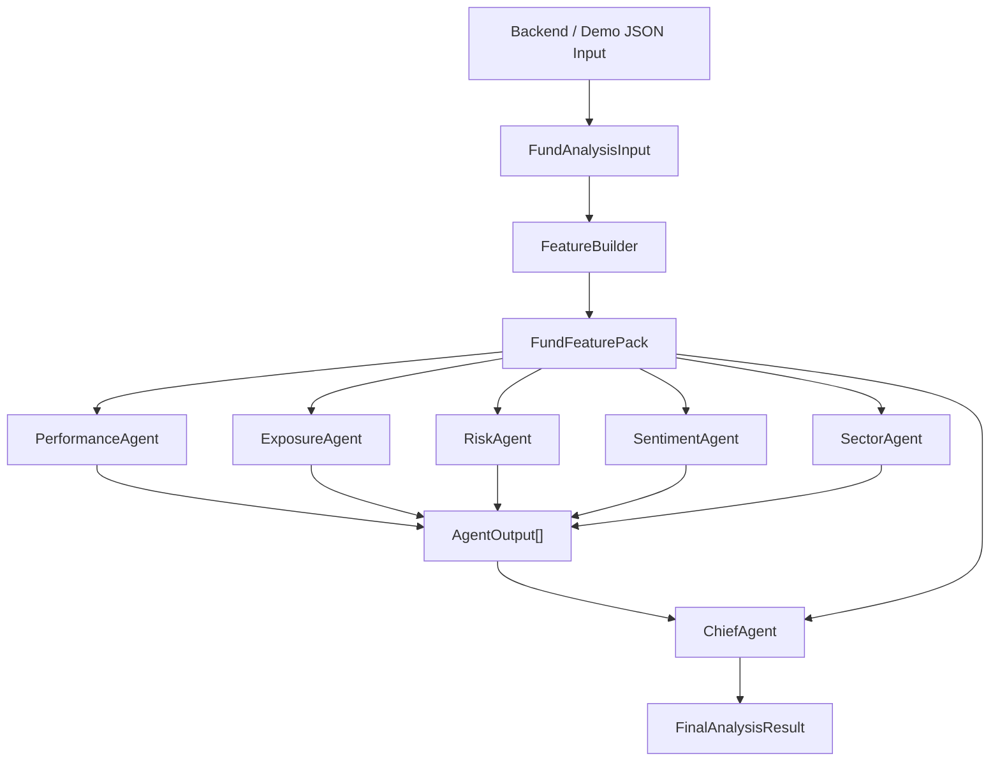

# Agent Architecture Design

## 1. 设计目标

智能体模块是 FundMaster AI 中的 LLM-based intelligent analysis layer。它的目标不是替代行情、净值、数据库或前端页面，而是在后端已经提供结构化基金数据之后，完成以下工作：

- 将基金输入数据转成稳定的结构化特征
- 让多个专业智能体从不同角度分析同一只基金
- 对每个智能体的结论做结构化输出
- 由 Chief Agent 汇总成最终投资观点
- 支持 mock mode 和 real-model mode，便于本地开发、团队联调和演示

当前版本可以作为 LLM analysis module 的 v1.0 MVP。它覆盖 fund-level analysis，并为后续 portfolio-level 和 sector-level analysis 预留扩展空间。

## 2. 模块边界

智能体模块只负责 AI 分析逻辑，不直接负责：

- 前端 Streamlit 页面
- Flask HTTP 路由
- MySQL / Redis 存储
- 外部基金、市场、新闻 API 抓取
- PDF 报告导出

这些能力应由系统其他模块提供。智能体模块通过 JSON contract 与后端交互：后端负责组装输入数据，智能体模块负责返回分析结果。

## 3. 总体架构



核心数据流为：

```text
FundAnalysisInput
  -> FeatureBuilder
  -> FundFeaturePack
  -> Specialist Agents
  -> ChiefAgent
  -> FinalAnalysisResult
```

## 4. 核心组件

### 4.1 Contracts

文件位置：`src/fund_llm/contracts.py`

Contracts 定义模块对外的稳定数据结构：

- `FundAnalysisInput`
  后端或 demo script 传入的原始基金分析请求。
- `FundFeaturePack`
  FeatureBuilder 生成的中间特征包，供所有 agent 共享。
- `AgentOutput`
  单个专业智能体的标准输出。
- `FinalAnalysisResult`
  ChiefAgent 聚合后的最终结果。

这样做的好处是前端、后端和 LLM 模块不用互相猜字段。只要 JSON contract 稳定，内部 agent 可以继续扩展。

### 4.2 FeatureBuilder

文件位置：`src/fund_llm/feature_builder.py`

FeatureBuilder 负责可计算、可测试的确定性指标，例如：

- 总收益率
- 近 1 月、3 月、6 月、1 年窗口收益
- 最大回撤
- 年化波动率
- 基准收益和超额收益
- 行业集中度
- 前十大持仓集中度
- 数据质量标记和缺失字段列表

设计原则是：能用公式算出来的内容先由代码计算，LLM 只负责解释、归纳和生成投资语言。

### 4.3 LLMClient

文件位置：`src/fund_llm/llm_client.py`

LLMClient 是统一模型调用层。当前采用 OpenAI-compatible Chat Completions 格式，因此可以通过环境变量切换不同 provider：

```env
LLM_API_KEY=
LLM_BASE_URL=
LLM_MODEL=
LLM_TIMEOUT_SECONDS=60
LLM_THINKING_MODE=
LLM_REASONING_EFFORT=
```

当前已验证的 provider 包括：

- Gemini OpenAI-compatible endpoint
- DeepSeek V4 OpenAI-compatible endpoint

本地测试和 CI 场景使用 `MockLLMClient`，不需要真实 API key。

### 4.4 BaseAgent

文件位置：`src/fund_llm/agents/base.py`

所有 specialist agents 共享同一个基础接口：

```text
analyze(features: FundFeaturePack) -> AgentOutput
```

每个 agent 必须返回标准 `AgentOutput`，包括：

- `agent_name`
- `status`
- `score`
- `stance`
- `key_points`
- `risks`
- `recommendations`
- `confidence`
- `narrative`

`safe_analyze` 提供失败隔离。如果某个 agent 抛出异常，系统不会整体失败，而是返回一个 `status="error"` 的 AgentOutput，并由 ChiefAgent 在最终结果中标记为 partial。

## 5. 当前智能体角色

| Agent | 输入重点 | 输出重点 | Proposal 对齐点 |
| --- | --- | --- | --- |
| `PerformanceAgent` | 收益率、窗口收益、回撤、基准超额收益 | 业绩表现、相对表现、趋势提示 | individual fund analysis |
| `ExposureAgent` | 行业暴露、前十大持仓、基金标签、规模、经理任期 | 集中度、风格暴露、配置建议 | portfolio / fund exposure analysis |
| `RiskAgent` | 波动率、最大回撤、风险窗口、数据质量 | 风险等级、主要风险来源、适配性提示 | risk analysis |
| `SentimentAgent` | 新闻摘要、结构化新闻、情绪标签、主题 | 新闻情绪、利好利空、事件风险 | financial news / sentiment analysis |
| `SectorAgent` | 行业暴露 breakdown、行业集中度 | 行业配置、主题倾斜、行业风险 | sector performance / sector analysis |
| `ChiefAgent` | 所有 AgentOutput 和 FundFeaturePack | 最终评级、核心论点、风险、行动建议 | central aggregation module |

当前 v1.0 的重点是 fund-level analysis。Market trend 和 capital flow 相关 agent 后续可以在有上游数据后继续补充。

## 6. 编排逻辑

文件位置：`src/fund_llm/orchestration/engine.py`

`AnalysisEngine` 负责端到端编排：

1. 接收 `FundAnalysisInput`
2. 调用 `FeatureBuilder.build`
3. 并行或串行执行 specialist agents
4. 收集所有 `AgentOutput`
5. 调用 `ChiefAgent.aggregate`
6. 返回 `FinalAnalysisResult`

当前支持通过 `max_workers` 控制并发：

- `max_workers=1`：串行执行，适合调试或 API rate limit 较紧时使用
- `max_workers=None`：默认按 agent 数量并行执行，适合真实模型演示提速

最终结果的 `metadata` 会记录：

- `agent_execution_mode`
- `agent_worker_count`
- `success_agent_count`
- `error_agent_count`
- `average_confidence`
- `agent_health`
- `llm_model`
- `llm_base_url`

## 7. 输入输出契约

### 7.1 输入

当前主入口是 `FundAnalysisInput`。最小必填字段：

- `request_id`
- `fund_info.code`
- `fund_info.name`
- `fund_info.asset_type`
- `nav_series`

推荐后端尽量提供：

- `industry_exposure`
- `top_holdings_weight`
- `news_items`
- `benchmark`
- `benchmark_nav_series`
- `fund_tags`
- `operational_metrics`
- `extra_context`

如果字段缺失，系统会继续运行，并在 `missing_fields` 和 `metadata` 中说明分析覆盖不足。

### 7.2 输出

最终输出为 `FinalAnalysisResult`：

- `overall_rating`
- `overall_score`
- `key_thesis`
- `main_risks`
- `action_plan`
- `agent_outputs`
- `summary`
- `score_explanation`
- `missing_fields`
- `metadata`

前端可以先消费这些字段：

- `summary` 展示 AI 总结
- `score_explanation` 展示为什么是当前评级/分数，适合作为 "Why This Rating" 模块
- `overall_rating` / `overall_score` 展示评级和分数
- `key_thesis` 展示核心观点
- `main_risks` 展示风险提示
- `action_plan` 展示再平衡或操作建议
- `agent_outputs` 展示分 agent 详情

## 8. Provider 切换设计

智能体模块不绑定某一家模型服务。真实模型通过环境变量配置：

Gemini 示例：

```env
LLM_BASE_URL=https://generativelanguage.googleapis.com/v1beta/openai/
LLM_MODEL=gemini-3-flash-preview
```

DeepSeek V4 示例：

```env
LLM_BASE_URL=https://api.deepseek.com
LLM_MODEL=deepseek-v4-flash
LLM_THINKING_MODE=disabled
```

这样团队成员可以在不同网络环境下使用不同 provider。深圳或中国大陆网络环境下，建议优先使用 DeepSeek V4；能稳定访问 Gemini API 的同学可以继续使用 Gemini。

## 9. 与 Flask 后端的集成方式

建议后端新增一个薄适配层：

```text
POST /api/ai/fund-analysis
```

后端职责：

- 从 market backend 获取基金净值、基金基础信息、行业暴露
- 从 news backend 获取新闻摘要和结构化新闻
- 组装成 `FundAnalysisInput` JSON
- 调用智能体模块
- 将 `FinalAnalysisResult` 返回给前端

智能体模块职责：

- 校验和解析输入
- 构建特征
- 执行多 agent 分析
- 返回结构化分析结果

这种设计可以避免 LLM 模块直接依赖数据库或外部 API，也方便前后端并行开发。

## 10. 可靠性设计

当前 v1.0 包含以下可靠性措施：

- Mock mode 支持无 API key 的本地测试
- 单元测试覆盖 contracts、feature builder、agents、engine、evaluation
- 单 agent 失败隔离，不影响整体流程
- 缺失字段显式记录
- Provider 配置集中在环境变量
- DeepSeek V4 thinking mode 可关闭，降低输出不稳定性
- golden cases 和 evaluation script 用于回归检查

当前验证命令：

```bash
python3 -m unittest discover -s tests
python3 scripts/run_mock_demo.py examples/mock_input.json
python3 scripts/run_real_demo.py examples/mock_input.json --max-parallel-agents 1
```

## 11. 后续扩展计划

为了进一步贴合 proposal，可以按以下方向扩展：

1. 新增 `MarketAgent`
   分析市场趋势、指数表现、市场风格切换。

2. 新增 `CapitalFlowAgent`
   分析资金流向、申赎、成交活跃度或北向资金等指标。

3. 新增 `PortfolioAnalysisInput`
   支持多基金组合层面的资产配置、风险分散和再平衡建议。

4. 新增 `SectorAnalysisInput`
   支持行业层面的比较、热力图和主题分析。

5. 增强 API adapter
   将 Flask 后端字段映射到标准 `FundAnalysisInput`，并为前端提供更稳定的 view model。

## 12. v1.0 定位

当前版本建议命名为：

```text
AI module v1.0: multi-agent fund analysis engine
```

它已经可以证明 proposal 中智能分析层的核心思路：

- 多源数据可以被整理为统一输入
- 量化指标先由代码计算
- 多个专业智能体从不同视角分析基金
- ChiefAgent 聚合中间结论
- 输出可解释的投资建议
- provider 可以在 Gemini 和 DeepSeek 之间切换

但它还不是完整 FundMaster AI 系统的 1.0，因为完整系统还需要前端、后端 API、数据库、缓存和真实数据采集模块共同完成。
